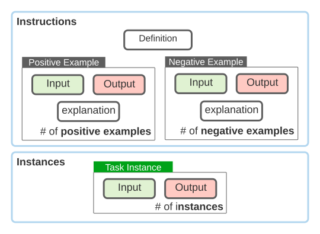

# A Repository of Community-Driven Natural Instructions 

**TLDR;** this repository maintains a community effort to create a large collection of tasks and their natural language definitions/instructions. 
We're looking for more contributions to make this data bigger! 🙌

## Background 
### Why define tasks in natural language?
While the current dominant paradigm (supervised learning with labeled examples) has been successful in building task-specific models. 
Such models can't generalize to unseen tasks; for example, a model that is supervised to solve questions cannot solve a classification task. 
We hypothesize that a model equipped with understanding and reasoning with natural language instructions should be able to generalize to any task that can be defined in terms of natural language.

### Any empirical evidence that this might be true?
In our [earlier effort](https://arxiv.org/abs/2104.08773), we built a smaller data (61 tasks) and 
observed that language models benefit from language instructions, i.e., their generalization to unseen tasks when they were provided with more instructions.  
Also, generalization to unseen tasks improves as the model is trained on more tasks.

### Why build this dataset?  
We believe that [our earlier work](https://arxiv.org/abs/2104.08773) is just scratching the surface and there is probably so much that be studied in this setup.
We hope to put together a much larger dataset that cover a wider range of reasoning abilities. 
We believe that this expanded dataset will serve as a useful playground for the community to study and build the next generation of AI/NLP models.


## Task definitions 
Each consists of input/output. For example, think of the task of sentiment classification:  
 - **Input:** `I thought the Spiderman animation was good, but the movie disappointed me.`
 - **Output:** `Mixed` 

Here is another example from the same task: 
 - **Input:** `The pumpkin was one of the worst that I've had in my life.` 
 - **Output:**  `Negative`  

Additionally, each ask contains a task *definition*: 
```
Given a tweet, classify it into one of 4 categories: Positive, Negative, Neutral, or Mixed.
``` 

Overall, each tasks follows this schema: 


Or if you're comfortable with json files, here is how it would look like: 
```json 
{
  "Definition": "",
  "Positive Examples": [ { "input": "", "output": [""],  "reason": ""} ], 
  "Negative Examples": [ { "input": "", "output": [""],  "reason": ""} ],
  "Instances": [ { "input": "", "output": [""]} ],
}
```

## How to contribute 

TBD

## Timeline 
 TBD 
<!--  To be included, your PR must be opened by -->    